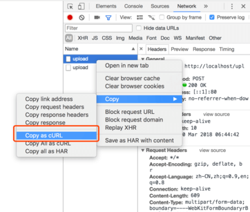
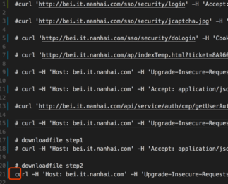

# curlas

## self1 

这个分支是写给我自己的

5.js 是一个很好用的正则的练习 s.replace(/(?:qty)|(?:[a-z]+Qty)/g, (x) => x+'D')

?: 的含义是什么
我用了分组，但是请不要为我分配组号，也不要捕获匹配到的文本

https://deerchao.net/tutorials/regex/regex.htm#regexoptions
https://developer.mozilla.org/zh-CN/docs/Web/JavaScript/Guide/Regular_Expressions


## npm install -g curlas

npm install -g curlas

## express

```
curlas "curl http://www.purepen.com -H 'A: 1' -H 'B: 2'" --javascript
curlas "curl http://www.purepen.com -H 'A: 1' -H 'B: 2'" --js
curlas "curl http://www.purepen.com -H 'A: 1' -H 'B: 2'" --js | node
curlas "curl http://www.purepen.com -H 'A: 1' -H 'B: 2'"
curlas "curl http://www.purepen.com -H 'A: 1' -H 'B: 2'" --bash
curlas "curl http://www.purepen.com -H 'A: 1' -H 'B: 2'" --sh
```

output

```
curl http://www.purepen.com \
-H 'A: 1' \
-H 'B: 2'
```

```
const request = require('request');

module.exports = function() {
  var url_ = "http://www.purepen.com";
  var opt_ = {
    "method": "GET",
    "headers": {
      "A": "1",
      "B": "2"
    },
    "url": url_,
  };
  return new Promise((resolve, reject) => {
    request(opt_, (err, res, body) => {
      if(err) return reject(err);
      if(res.statusCode !== 200) {
        return reject(new Error('statusCode'+res.statusCode));
      }
      return resolve({
        header: res.headers,
        body
      });
    });
  });
}

module.exports()
.then(console.log)
.catch(console.error)
```
## but, save file for upload request 




```sh
vi /tmp/curl.sh
save to file

cat /tmp/curl.sh
curl 'http://localhost:3333/upload' -H 'Origin: http://localhost' -H 'Accept-Encoding: gzip, deflate, br' -H 'Accept-Language: zh-CN,zh;q=0.9,en;q=0.8' -H 'User-Agent: Mozilla/5.0 (Macintosh; Intel Mac OS X 10_12_2) AppleWebKit/537.36 (KHTML, like Gecko) Chrome/64.0.3282.186 Safari/537.36' -H 'Content-Type: multipart/form-data; boundary=----WebKitFormBoundaryrBg7MlrcbamQBPGE' -H 'Accept: */*' -H 'Referer: http://localhost/' -H 'Connection: keep-alive' --data-binary $'------WebKitFormBoundaryrBg7MlrcbamQBPGE\r\nContent-Disposition: form-data; name="name"\r\n\r\n0.txt\r\n------WebKitFormBoundaryrBg7MlrcbamQBPGE\r\nContent-Disposition: form-data; name="uuid"\r\n\r\n15622520882158097\r\n------WebKitFormBoundaryrBg7MlrcbamQBPGE\r\nContent-Disposition: form-data; name="file"; filename="0.txt"\r\nContent-Type: text/plain\r\n\r\n\r\n------WebKitFormBoundaryrBg7MlrcbamQBPGE--\r\n' --compressed

curlas /tmp/curl.sh --js
```

output




## more example
```sh
curlas "curl 'http://www.purepen.com' -H 'Upgrade-Insecure-Requests: 1' -H 'User-Agent: Mozilla/5.0 (Macintosh; Intel Mac OS X 10_12_2) AppleWebKit/537.36 (KHTML, like Gecko) Chrome/64.0.3282.186 Safari/537.36' --compressed" --js | node
```

output

```
null 200 blabla
```

## 遗留问题

- kibana https 查询出来的数据没有解密？
